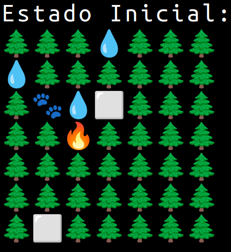

<p align="center">
  
</p>


# Documentação do Projeto de Simulação de Espalhamento de Fogo e Movimento de Animais

## Introdução

Projeto desenvolvido para a disciplina de Algoritmos e Estruturas de Dados (AEDS), do Centro Federal de Educação Tecnológica de Minas Gerais (CEFET-MG), Campus V – Divinópolis.  Disciplina ministrada pelo professor Michel Pires.

Este projeto implementa uma simulação que modela a propagação de fogo em uma matriz que representa um ambiente em 2D, enquanto um animal tenta se mover dentro desse ambiente. O objetivo principal é observar a interação entre o fogo e o animal, além de registrar a trajetória do animal e as mudanças no ambiente à medida que o fogo se espalha.

A simulação utiliza uma estrutura de dados que representa o ambiente, onde diferentes células podem ser árvores, água, áreas queimadas ou áreas vazias. O código é implementado em **C++** e é estruturado em várias classes e arquivos que encapsulam as funcionalidades específicas.

---

## Metodologia

A metodologia implementada no projeto é dividida em várias etapas:

### Estrutura de Dados

- A classe `MatrixStruct` é usada para armazenar informações sobre a matriz do ambiente, como:
  - Coordenadas iniciais (`initial_x`, `initial_y`)
  - Número de linhas (`rows`) e colunas (`columns`)
  - A própria matriz (`matrix`)

### Espalhamento de Fogo

A classe `Fire` é responsável por gerenciar a propagação do incêndio na matriz da floresta, seguindo regras de propagação configuráveis (com ou sem vento). Abaixo estão os detalhes técnicos:

```cpp
bool spreadIteration()  
    Se burningQueue vazia → retorna false  
    Para cada célula na fila:  
        Se é a primeira queima:  
            Marca como 2  
            Propaga fogo aos vizinhos (processSpread)  
        Senão:  
            Marca como 3  
    Atualiza fila para próxima iteração  
    Retorna true se houver células restantes  
```

A função  `spreadIteration` controla a evolução do incêndio em uma iteração da simulação. Ela processa as células em chamas armazenadas na fila `burningQueue`, atualizando seu estado: células queimando pela primeira vez são marcadas como `2` (em chamas) e propagam o fogo para vizinhas válidas (via `processSpread`), enquanto células já queimadas são atualizadas para `3` (totalmente queimadas) e removidas do ciclo. Novos focos são armazenados em `nextSpread` e transferidos para `burningQueue`, garantindo a continuidade da propagação na próxima iteração. A função retorna `true` se houver células ativas, mantendo a simulação em execução, ou `false` quando o fogo se extingue. A configuração do vento é aplicada durante a propagação, limitando direções permitidas.

```cpp
void processSpread(x, y):  
    para cada direção em [Norte, Sul, Oeste, Leste] faça:  
        se (VENTO_ATIVO E direção não está em DIRECOES_DO_VENTO):  
            pule esta direção  
        
        newX = x + offsetX[direção]   
        newY = y + offsetY[direção]    
                
        se (newX, newY está dentro dos limites E matriz[newX][newY] == 1):  
            matriz[newX][newY] = 2    
            adicione (newX, newY) à lista nextSpread   
```


### Movimento do Animal

- A classe `Animal` controla o movimento do animal no ambiente.
- A lógica aplicada considera:
  - Áreas seguras onde o animal pode se mover
  - Registro da trajetória
  - Número de passos dados

A classe `Animal` é responsável, principalmente, pela lógica de movimentação do animal. Nela, são implementados métodos como `moveAnimal`, que concentra a lógica principal de deslocamento.

Foi implementada uma regra de movimentação em que o animal analisa as casas adjacentes e verifica suas prioridades. Se houver duas ou mais casas com a maior prioridade entre as adjacentes, a movimentação é escolhida aleatoriamente entre elas. Caso exista apenas uma casa com a maior prioridade, o animal se move automaticamente para essa casa.

```cpp
bool função moveAnimal():
    se shouldStayInEmptyArea() retornar verdadeiro:
        retorne verdadeiro
    
    resetStayCounter()  
    
    int prioridade_maxima = -1
    vetor<célula> células_candidatas  
    
    para cada direção em [0..3]:
        novo_x = x + dx[direção]
        novo_y = y + dy[direção]
        
        se novo_x e novo_y estão dentro dos limites:
            tipo_célula = matriz[novo_x][novo_y]
            
            se tipo_célula ≠ BURNING (não está em chamas):
                prioridade = getCellPriority(tipo_célula)  
                
                se prioridade > prioridade_maxima:
                    prioridade_maxima = prioridade
                    células_candidatas.limpar()
                    células_candidatas.adicionar( (novo_x, novo_y) )
                    
                senão se prioridade == prioridade_maxima:
                    células_candidatas.adicionar( (novo_x, novo_y) )
    
    se células_candidatas não está vazio:
        escolhe célula aleatória em células_candidatas
        steps++  
        
        se célula escolhida é WATER:
            converte célula para EMPTY
            waterFound++
            convertWaterToForest(novo_x, novo_y) 
        
        x = novo_x
        y = novo_y
        pathSequence.adicionar( (x, y) )
        recordPosition()
        retorne verdadeiro
        
    senão:
        retorne falso  
```


### Tratamento de Entrada e Saída

- A classe `FileReader` lida com a entrada e saída de dados:
  - Leitura do estado inicial da matriz a partir de um arquivo
  - Escrita dos resultados da simulação em outro arquivo

### Simulação

- A classe `Simulation` coordena a interação entre as classes `Fire` e `Animal`.
- Invoca os métodos adequados em cada iteração e registra o estado da matriz no arquivo de saída.

### Utilização de Direções e Prioridades

- Direções de movimento e prioridades de terrenos são definidas e utilizadas tanto para:
  - O movimento do animal
  - A propagação do fogo
- Considerando sempre as possíveis direções de risco.

---

## Estudo de Caso / Resultados

A simulação foi testada com diferentes configurações, onde o ambiente foi inicializado com diversas disposições de árvores e água. Os resultados mostraram que o comportamento do fogo e do animal era sensível à configuração inicial da matriz.

### Os dados coletados foram analisados em relação a:

- A taxa de propagação do fogo em áreas densamente arborizadas em comparação com áreas com água.
- A capacidade do animal de encontrar rotas seguras para evitar áreas em chamas.

Os resultados são documentados com um **log** que mostra:

- A trajetória do animal
- O progresso do fogo

As saídas são gravadas em um arquivo `output.dat` para referência futura.



---

## Conclusão

A simulação demonstrou com sucesso a interação entre o fogo e o animal em um ambiente bidimensional. A implementação permitiu visualizar claramente:

- A propagação do fogo
- O movimento do animal diante de diversas condições

As possibilidades de extensões futuras, como a inclusão de vento e outros fatores ambientais, foram identificadas como áreas para melhorias.

---

## Referências


---

## Modo de Compilação

Para compilar e executar o projeto, siga os passos abaixo:

